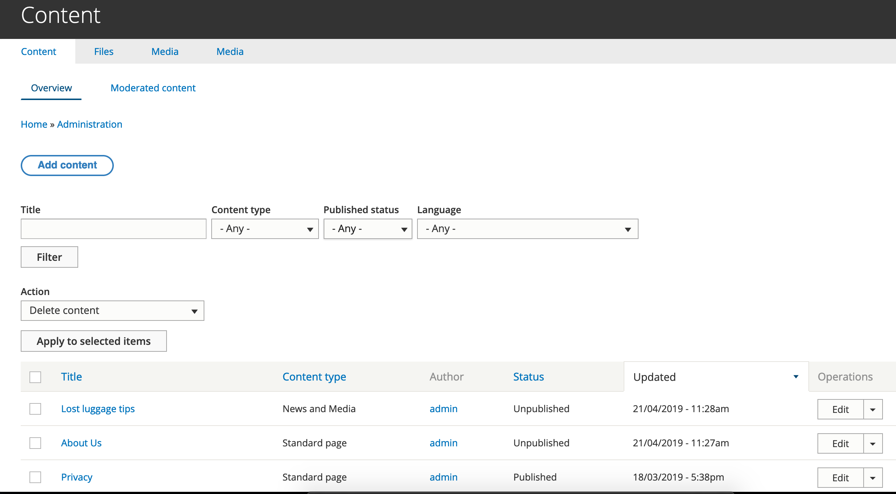

# Designing and planning content

In the previous unit we discussed content requirements, focusing on the areas we’d need to consider when planning a site, such as content types, blocks, user requirements \(both for the site visitor and the CMS user\), user roles and permissions and content moderation workflow.

Content requirements usually affect the site structure and data models, including content types, fields, block types, taxonomies and media types. Considering our fictional example of the Jobs Portal, let’s assume these are the outcomes of the content planning:

1. Defined content types, fields and widgets
2. Defined content display and View Modes
3. Defined Media types, fields and media display
4. Defined taxonomy vocabularies
5. Defined user roles and permissions
6. Defined content moderation workflow\(s\)

### 2.1 Content types

GovCMS uses content types to create a variety of pages to meet different needs. For example, news pages look different to event pages. Content types also allow you to capture different information for various purposes. For example, an Event content type captures event date \(or dates\) and location\(s\), unlike any other content types.

GovCMS comes with many content types out-of-the-box \(OOTB\). In this section you’ll learn about structuring content and planning content types.

#### Steps to create a content type

New content types can be easily created in GovCMS. Follow these simple steps to create a new content type:

1. Plan the content type. Think about what you should call it, how it should be displayed and what fields you’ll need.
2. Create a content type
3. Configure default settings
4. Add custom fields
5. Configure form display and widgets
6. Manage display and view modes
7. Add taxonomy
8. Update permissions

#### **Exercise 2.1:** Compare content types out-of-the-box

In this exercise we’ll compare content form and display using the default content types in GovCMS. We explore some fields and form widgets and how these can change between content types.

* * * 1. Add content

  1. Click Content → Add content
     1. Create a **Standard page** titled “About us” _Use a Lorem Ipsum generator to add placeholder text_. Do not add the page to the menu and keep all other defaults. Publish the page.
     2. Create a **News and Media** article titled “Salary rates in 2019 for Government employees” Again, _Use a Lorem Ipsum generator to add placeholder text_. Do not add the page to the menu and keep all other defaults. Publish the page.
        1. Compare content type
  2. Go to Admin → Content 
  3. Compare the editing forms and content display. **News and Media** and **Standard Pages** have different default settings.

