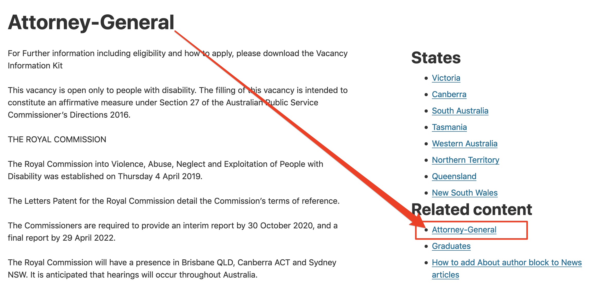

# Related content by term

Site visitors would like to see content related to a specific state/territory. To do this, we need to set up an automatically generated **list of States/Territories in a block** with the following features:

1. When we click on a term such as “ACT” we go to a term listing page that shows all content tagged or categorised with that term.
2. If we then select a specific article such as “Volunteering” we see the full content page.
3. In the sidebar of the “Volunteering” full node page we also see a “related content” block. This will pull in a list of content that’s been tagged or categorised with the same taxonomy term.

In the following exercises we'll make a “list of terms” block and then we'll make the related content block.

#### **Exercise 6.5:** Make a list of States/Territories block

In this exercise we’ll add a list of the **States and Territories** in the sidebar, so the page looks like the screenshot below.  
 

1. Go to **Structure** → **Views**. Click **+ Add new View**. Add in these settings:

* View name: States/Territories
* Select to enable **Description**: A list of State and Territory terms
* Show _Taxonomy_ terms of type _State/Territory_ sorted by _Unsorted_
* Select Create a block
* Block title: States/Territories
* **Display format**: _HTML list_ of _Fields_
* Items per block: 0
* **Use a pager**: Leave unselected
* Click Save and edit

1. Go to Structure → Block Layout.
2. In the _Sidebar_ area click the **Place block** button.
3. Find **States/Territories** block in **Lists \(Views\)** category and click the **Place block** button.
4. Configure block visibility settings to only display it on the **Job Posting** _content type_.
5. Click Save block.
6. Navigate to a _Job posting_ content page and locate your block.

#### **Exercise 6.6:** Build the related content block

Next we’ll add the related content block, as per the screenshot below.

1. **Check content tags**

Make sure you have some content tagged with the _State/Territory_ terms.

**Create the View**

**Click Save and edit.**

**Add dynamic "contextual" filter**

The contextual filter allows us to show a list of the content with the same tags as the current content.

**Place the block**

1. Go to **Structure** → **Blocks** and scroll down to the “Sidebar” area
2. Click the **Place block** button.
3. In the pop-up, filter by text “Related content” in the **Lists \(Views\)** category.
4. Place block.
5. Under Visibility settings, configure block to display on all pages except the homepage. Remember to use the &lt;front&gt; token as the homepage identified. You may also use “/”. In addition, filter the block to only show on the following content types:

**Job Posting**

* 1. Click Save block.

**Review and test**

Go to the frontend of your site and check that the Related content block has been added, as in the below screenshot.  
****

Check that you have some content in certain states/territories, so you can see how the block works.

* When you click on a state \(tag\) on a specific article you should see a list of related content, listed by the taxonomy term. You should not see the block.
* You should see the Related Content block when you view a job posting or News and Media article.

**Filter out currently displayed page**

While testing the Related content block, did you notice anything unusual?

The **Related content** block displays the article title of the currently displayed page:

Let’s remove it by adding one more _Contextual Filter_.

1. Return to editing the _Related Content_ view.
2. Expand the _Advanced_ pane and you should see the _Contextual Filter_ **Content: Has taxonomy term ID** that we created earlier.
3. Add another contextual filter
4. Search for ID. 
5. Select _Provide default value_ in the When the filter value is NOT available pane → Content ID from URL. 
6. Under the **More** pane, select **Exclude**
7. **Apply** the changes.
8. Save the View.
9. Test your block from the previous example. Now it shouldn’t display the current page in the block.

